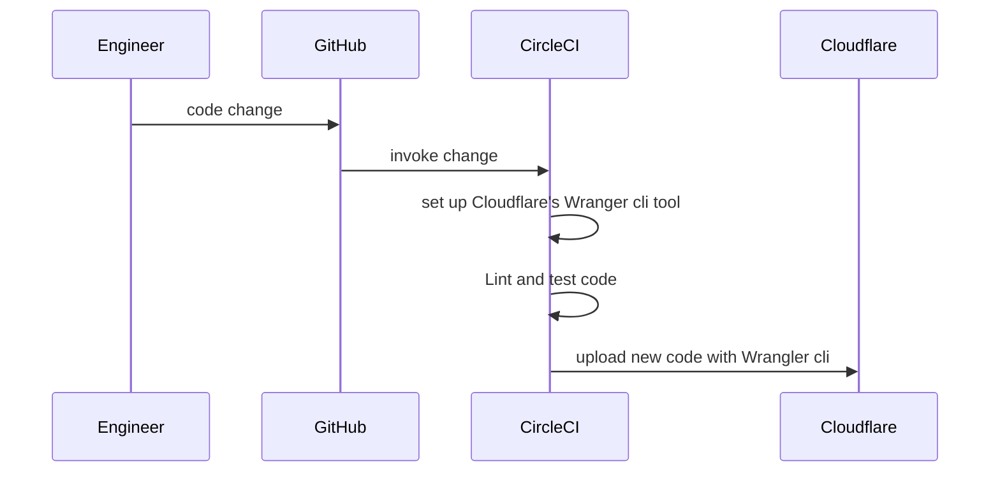

## Cloudflare Worker

[](https://dl.circleci.com/status-badge/redirect/gh/Rusty-Magnet-Ltd/cloudflare_worker/tree/master)

Code powers [foobar.rustymagnet.xyz](https://foobar.rustymagnet.xyz/).

## Learnings

### Testing

> [!CAUTION]
> Expect hard to debug errors if there are tools on your machine proxying client connections or intercepting DNS queries.


Testing required `"cloudflare:test"` to access `environment variables` in tests:

```typescript
import { env } from "cloudflare:test";

it("/carpark ok", async () => {
    const res = await app.request("/carpark", {}, env);
    expect(res.status).toBe(200);
});
```

### Secrets

Local code uses a `.dev.vars` to read secret environment variables.  The normal `.env` file is used by Cloudflare code.

### Environment

Environment specific values can be set in the `wrangler.toml` file as below; these can be source controlled safely as these are overridden locally by the .devs.vars ( local tests ) and production secrets.

```yaml
[env.testing.vars]
  SECURITY_HEADER_NAME = "X-Header"
  SECRET_KEY = "dummy"
  ENVIRONMENT = "TESTING"
```

The environment setting can be fed to vitest: `wrangler: { configPath: "./wrangler.toml", environment: "testing" }`

### Deploy

> [!CAUTION]
> Always set the correct `deploy flag` when uploading the Cloudflare `npx wrangler deploy -e prod`.  Get this wrong and you can override real production secrets.

> [!INFO]
Cloudflare suggest [here](https://developers.cloudflare.com/workers/wrangler/configuration/) treating your wrangler.toml file as the source of truth for your Worker configuration.

### Debug

`console.log()` output is available.  Use the `tail` command in the cli tool.  This also outputs Cloudflare added headers like cf-ipcountry, asn, ray-id, True IP.

```shell
wrangler tail foo
```
When errors happened inside a Worker, the output to the console was limited:

```shell
[ERROR] Uncaught (async) Error: internal error
```

But the logs helped:

```shell
Logs were written to "/<home>/.wrangler/logs/wrangler-2024-11-16.log"
DNS lookup failed.
```

### Workflows

You could start a backend workflow using a `workflow`; this was written using `QStash` from `Upstash`.  

To test it locally, `ngrok` was used to route all of the Worker requests via ngrok.  So you no longer went to `localhost:8787/carpark`.  Instead you used: `https://abcd.ngrok-free.app/carpark`

> [!CAUTION]
> This wouldn't work when other software were proxying client connections.

```shell
# start ngrok
ngrok http localhost:3001 --log=stdout

# set local environment .dev.vars
QSTASH_TOKEN="xxxx"
UPSTASH_WORKFLOW_URL="https://abcd.ngrok-free.app"

# inspect state of requests or local tunnelling
http://localhost:4040/inspect/http
http://localhost:4040/status
```


## Set up

### Deploy code to Cloudflare Worker




## Design choices

- Started on [itty-router](https://itty.dev/itty-router). But docs and testing were clearer with [Hono](https://hono.dev/guides/examples).
- The app used `Grouping` of routers to slim down code into discrete files.  Link [here](https://hono.dev/docs/api/routing).
- Local dev connects to `ngrox` tunnelling.
- Setting the `ENVIRONMENT` variable needs to be handled; a great article [here](https://www.raulmelo.me/en/blog/best-practices-for-handling-per-environment-config-js-ts-applications)
- A [Boilerplate](https://github.com/marcosrjjunior/hono-boilerplate/tree/main/src/routes) on structuring project.
- The JWT work was based these [helpers](https://hono.dev/helpers/jwt).
